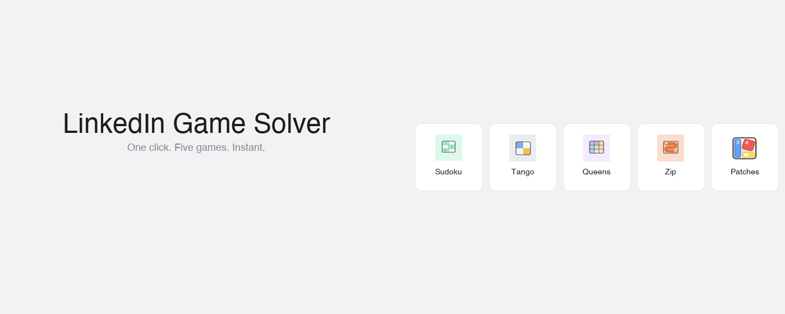

# LinkedIn Games Solver

Chrome extension that instantly solves all five LinkedIn games — **Sudoku**, **Tango**, **Queens**, **Zip**, and **Patches**.

Built with vanilla JavaScript. No frameworks, no AI, no server — just DOM parsing, constraint solvers, and the Chrome Debugger Protocol.



## How it works

Each game has a dedicated solver that reads the board state directly from the DOM (or React fiber internals when needed), computes the solution, and enters it automatically.

| Game | Algorithm | Input Method |
|------|-----------|-------------|
| **Sudoku** | Backtracking (6x6 with box constraints) | Click cell + number button |
| **Tango** | Constraint propagation + backtracking | Click cycling (empty → sun → moon) |
| **Queens** | Backtracking with region/adjacency pruning | Double-click placement |
| **Zip** | Hamiltonian path solver with wall detection via React fiber, CSS borders, or connector elements | Chrome Debugger Protocol (trusted mouse drag) |
| **Patches** | Reads solution from React fiber game state | Chrome Debugger Protocol (trusted drag-and-drop) |

### Technical highlights

- **React Fiber traversal** — Zip and Patches read game state (walls, waypoints, solution regions) by walking React's internal fiber tree, bypassing the need to reverse-engineer DOM structure
- **Chrome Debugger Protocol** — Zip and Patches require trusted input events (drag gestures) that can't be faked with `dispatchEvent`. The background service worker attaches via `chrome.debugger` and dispatches `Input.dispatchMouseEvent` commands
- **Multi-frame injection** — LinkedIn games run inside iframes. Solvers are injected into all frames simultaneously, with results polled from any frame that finds the board
- **Three-mode wall detection** (Zip) — Tries React fiber first, falls back to CSS connector elements, then border-width analysis
- **Auto-detection** — If you're already on a game page, it starts solving the moment you open the popup

## Install (developer mode)

1. Clone this repo
2. Open `chrome://extensions`
3. Enable **Developer mode**
4. Click **Load unpacked** → select this folder
5. Navigate to any LinkedIn game and click the extension icon

## Project structure

```
├── manifest.json          # Chrome extension manifest (v3)
├── background.js          # Service worker — CDP mouse events for Zip & Patches
├── popup/
│   ├── popup.html         # Extension popup UI
│   ├── popup.js           # Game selection, auto-detect, script injection
│   └── popup.css          # LinkedIn-style UI
├── solvers/
│   ├── sudoku.js          # 6x6 Sudoku backtracking solver
│   ├── tango.js           # Suns & Moons constraint solver
│   ├── queens.js          # N-Queens with color region constraints
│   ├── zip.js             # Hamiltonian path with wall detection
│   └── patches.js         # Shape placement via React fiber
└── icons/                 # Extension icons and game icons
```

## Stack

- Vanilla JavaScript (no build step)
- Chrome Extension Manifest V3
- Chrome Debugger Protocol (CDP)
- Content script injection via `chrome.scripting`
